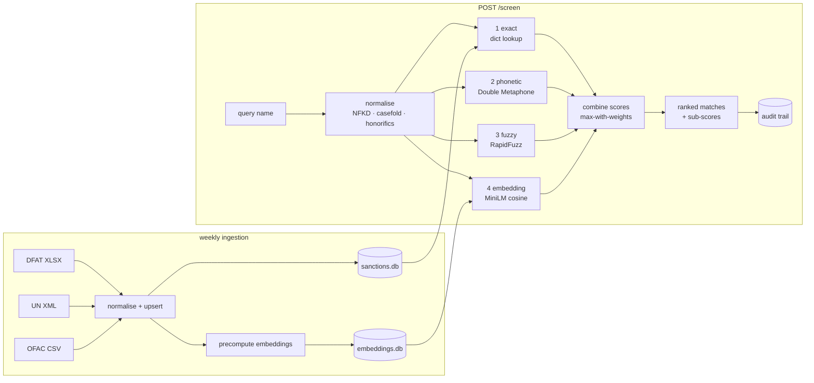

# SanctionScreen

[](https://github.com/zr101/sanctionscreen/actions/workflows/ci.yml)
[](https://sanctionscreens.streamlit.app)

A KYC name-screening microservice that screens customer names against three
official sanctions lists — Australia's **DFAT Consolidated List**, the
**UN Security Council Consolidated List** and the **US OFAC SDN List** — and
returns ranked, *explainable* matches with a full audit trail.

**▶ Try it live: [sanctionscreens.streamlit.app](https://sanctionscreens.streamlit.app)** —
type *Osama bin Laden*, *Vladimr Putin* or *Владимир Путин* and expand a
match to see the layer-by-layer scoring.

Built as a portfolio project for AML/financial-crime and data roles: every
reporting entity under Australia's AML/CTF Act must screen customers against
the DFAT Consolidated List, and the interesting part of that problem is not
the lookup — it's the names.

## The problem: names don't match themselves

Exact string matching fails on real sanctions data. One listed individual is
spelled *Usama bin Ladin* on the OFAC list, *Osama bin Laden* in most Western
media, and *أسامة بن لادن* in the original Arabic. A customer might be
onboarded as "Laden, Osama Bin". None of these are equal as strings, and a
screening system that misses them fails at its one job. The same applies to:

- **transliteration variants** — Mohammed / Muhammad / Mohamed / Mohamad
- **name-order swaps** — *Ali Hassan* vs *Hassan Ali*
- **typos** — *Vladimr Putin*
- **dropped middle names** — *Saddam Hussein* vs *Saddam Hussein al-Tikriti*
- **honorifics** — *Haji Abdul Manan* vs *Abdul Manan*
- **different scripts entirely** — *Владимир Путин* vs *PUTIN, Vladimir*

SanctionScreen layers four matching strategies, cheapest first, and combines
them into one 0–100 score with per-layer sub-scores so an analyst can see
*why* a name matched:

```text
$ curl -s -X POST localhost:8000/screen -H 'Content-Type: application/json' \
    -d '{"name": "Usama bin Ladin"}'

score 93.0 — "BIN LADIN, Usama" (OFAC 6365)
  exact 0 · phonetic 100 · fuzzy 92.5 · embedding 89.8
```

## Architecture



Layer combination is `score = max(1.00·exact, 0.97·fuzzy, 0.90·phonetic,
0.85·embedding)` plus a small corroboration bonus when several independent
layers agree — so an exact hit is always 100, a fuzzy-only hit caps at 97,
and the threshold keeps an intuitive meaning. All weights are configurable
(`config/default.toml`, overridable via `SANCTIONSCREEN_*` env vars); the
reasoning behind each default is recorded in [DECISIONS.md](DECISIONS.md).

## Benchmark

Measured over a seeded adversarial fixture generated from real list entries
(200 perturbed positives + 100 clean negatives; `eval/`), full pipeline with
embeddings on:

### Precision / recall by threshold

| Threshold | Precision | Recall | F1 | TP | FP | FN |
|---:|---:|---:|---:|---:|---:|---:|
| 60 | 0.693 | 0.925 | 0.792 | 185 | 82 | 15 |
| 70 | 0.902 | 0.920 | 0.911 | 184 | 20 | 16 |
| **75** | **0.913** | **0.890** | **0.901** | 178 | 17 | 22 |
| 80 | 0.933 | 0.830 | 0.878 | 166 | 12 | 34 |
| 90 | 0.969 | 0.620 | 0.756 | 124 | 4 | 76 |

### Recall by perturbation type (threshold 75)

| Perturbation | Cases | Recall |
|---|---:|---:|
| transliteration | 40 | 1.000 |
| order_swap | 30 | 1.000 |
| typo | 40 | 0.975 |
| nickname | 20 | 0.900 |
| spacing_hyphen | 40 | 0.750 |
| dropped_middle | 30 | 0.700 |

### Latency (in-process, 54k names, embeddings on)

| p50 | p95 |
|---:|---:|
| 37 ms | 65 ms |

Reproduce with `uv run python eval/benchmark.py` (regenerate the fixture
with `uv run python eval/generate_testset.py`).

## Quickstart

```bash
docker compose up --build
```

builds and starts the API on `:8000` (Swagger docs at
[localhost:8000/docs](http://localhost:8000/docs)) and the Streamlit tester
UI on [localhost:8501](http://localhost:8501). Then:

```bash
curl -s -X POST http://localhost:8000/screen \
  -H 'Content-Type: application/json' \
  -d '{"name": "Usama bin Ladin", "threshold": 75, "max_results": 5}' | jq
```

Local development (Python 3.12 via [uv](https://docs.astral.sh/uv/)):

```bash
uv sync --all-extras                                   # or plain `uv sync` for layers 1-3 only
uv run python -m sanctionscreen.ingestion.cli --source all   # refresh lists + vectors
uv run uvicorn sanctionscreen.api.main:app             # API on :8000
uv run streamlit run ui/app.py                         # UI on :8501
uv run pytest                                          # tests
```

> macOS note: some uv versions mark venv files with the `hidden` flag, which
> Python ≥3.12 skips when processing editable-install `.pth` files. Tests are
> immune (pytest adds `src/` to `pythonpath`); for ad-hoc scripts use
> `PYTHONPATH=src` or `chflags nohidden .venv/lib/python3.12/site-packages/*.pth`.

## API reference

| Endpoint | Description |
|---|---|
| `POST /screen` | Screen a name. Body: `{name, threshold?, max_results?, entity_type?}`. Returns ranked matches with per-layer sub-scores, source provenance and a `screening_id`. |
| `GET /health` | Service status, embedding-layer state, per-list refresh timestamps. |
| `GET /lists` | Entity/name counts and last refresh for each loaded list. |
| `GET /entity/{list}/{ref}` | Full raw source record for one listed entity (analyst drill-down). |

Every `/screen` call is persisted to the `screenings` audit table
(screening id, timestamp, query, parameters, match count, top score, full
result JSON) — reconstructable screening decisions are a regulatory
expectation for reporting entities. Full schemas live in the OpenAPI docs at
`/docs`.

## List sources & refresh

| List | Publisher | Format | URL pinned in `config/default.toml` |
|---|---|---|---|
| DFAT Consolidated List | dfat.gov.au | XLSX | new post-Nov-2025 format |
| UN Security Council Consolidated List | scsanctions.un.org | XML | redirects to a signed, expiring blob URL |
| OFAC SDN | sanctionslistservice.ofac.treas.gov | CSV ×4 | headerless legacy flat files |

A GitHub Actions workflow (`refresh-lists.yml`) re-ingests all three lists
every Monday ~04:00 AEST and commits the refreshed SQLite database with a
summary in the commit message. Ingestion is idempotent (upsert by source +
reference number), falls back to cached copies in `data/cache/` when a
download fails, and records every run in an `ingestion_log` table.

## Threshold tuning

The threshold is a precision/recall dial — pick it from the benchmark table
above, not by gut feel:

- **75 (default)** — balanced: ~0.91 precision at ~0.89 recall. Sensible for
  onboarding flows where a human reviews every hit.
- **60–70** — recall-first: catches nearly everything but roughly one flag in
  ten (at 70) to one in three (at 60) is noise. Use for enhanced due
  diligence or retrospective look-backs where missing a hit is worse than
  reviewing extra candidates.
- **80–90** — precision-first: almost every flag is real, but recall drops to
  0.62 at 90 — you *will* miss perturbed names. Only defensible for
  low-risk, high-volume flows with a secondary control downstream.

Weakest perturbations at 75 are dropped middle names (0.70) and
spacing/hyphen changes (0.75): if those matter for your risk appetite, lower
the threshold and accept more review workload.

## Engineering notes

- **Python 3.12**, `src/` layout, typed (mypy-clean), ruff-formatted, uv lockfile.
- **SQLite** for everything — lists, ingestion log, audit trail — so the
  whole service state is one committable artifact. Embedding vectors live in
  a separate regenerable `data/embeddings.db` to keep the repo slim.
- **~100 tests** covering normalisation (Unicode, Arabic, empty/long names),
  each matching layer, score combination, parsers for all three source
  formats, idempotent re-ingestion, and the API surface via TestClient.
- **CI** (`ci.yml`): ruff + format check + mypy + pytest on every push.
- **Docker**: multi-stage; the API image bakes the HF model *and*
  precomputed vectors so containers start instantly and run fully offline
  (`HF_HUB_OFFLINE=1`). `--build-arg WITH_EMBEDDINGS=0` builds a ~10× smaller
  image running layers 1–3 only.

## Limitations & disclaimer

- **Name screening only.** No date-of-birth or nationality disambiguation,
  no fuzzy DOB matching, no adverse-media or PEP screening.
- **Benchmark optimism.** The eval fixture perturbs names that are already
  in the index, so absolute recall is flattering; treat the numbers as
  relative (threshold-to-threshold) guidance.
- **List coverage.** Three lists, refreshed weekly. A production deployment
  would refresh at least daily (DFAT publishes intraday changes) and consume
  the EU, UK OFSI and other lists as required.
- **Alias quality is not weighted.** DFAT "Weak" aliases score the same as
  "Strong" ones; a production system would discount weak aliases.
- **This is a portfolio/demonstration project.** It is not legal advice, not
  an AUSTRAC-endorsed tool, and not a substitute for a commercial screening
  product with vendor SLAs, list QA and tuning support.

---

*Data sources are public documents published by DFAT, the UN Security
Council and the US Treasury (OFAC). This repository redistributes them
unmodified as cached snapshots for reproducibility.*
