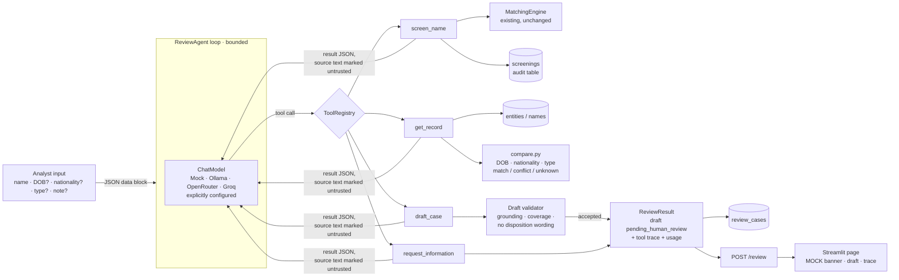

# Case study: a tool-using screening-review assistant

**Status:** working code with a labelled offline mock and a live free OpenRouter
runtime. A real tool-calling model has been evaluated separately from the mock.
The local API/UI run under macOS login services with crash recovery. Provider
setup and operations: [free-runtime.md](free-runtime.md).
The follow-up hosted integration also adds a Review assistant workspace to the
existing `demo/app.py`, reusing the agent directly within the Streamlit process.
[Cloud setup](../demo/README.md) keeps the same public app URL.

## The problem

SanctionScreen already answers "does this name look like a listed name?" with
a deterministic, explainable score. That is where an analyst's work begins.
For each hit they still have to:
- open the list record;
- check the customer's date of birth, nationality and type against it;
- notice what conflicts as well as what matches;
- ask for missing details when two records can't be told apart;
- write up a case that cites its sources.

A language model can help with that write-up, but three risks come with it:
- the model treats a name match as an identity match;
- it invents details that aren't in the record;
- it is talked out of human review, either by a pushy note in the case or by
  text inside a source record.

## What was built

A review loop in which the **model chooses** among four narrow tools, while
deterministic code supplies every fact and checks every draft.



| Concern | Where it lives | Who decides |
|---|---|---|
| Name similarity score | existing `MatchingEngine` (unchanged) | deterministic code |
| DOB / nationality / type agreement | `review/compare.py` | deterministic code |
| Which tool to call next, and with what arguments | the model | model |
| Wording of the draft and assessment per candidate | the model | model, then validator |
| Whether the draft is acceptable | `ReviewTools.validate_draft` | deterministic code |
| Final disposition | — (not represented anywhere) | human reviewer |

### Tools

- **`screen_name(name, entity_type?, threshold?)`** wraps `MatchingEngine.screen` and
  writes the existing `screenings` audit row. The threshold has a floor of 60 and
  results are capped at 5. Each candidate carries its `record_id` (`OFAC:12345`)
  and the engine's sub-scores, with a note that the scores measure name
  similarity only.
- **`get_record(record_id)`** only accepts IDs returned by `screen_name` in the
  same run. It returns structured fields and a capped raw excerpt under
  `untrusted_source_text`. It also returns the comparator's verdicts against
  the details the analyst entered; the model cannot supply or alter those
  details.
- **`request_information(fields, reason)`** ends the run asking for specific
  details. All candidates must have been retrieved first. Provided fields are
  removed from the question. If identifiers can already be compared, the model
  must draft the available evidence and list remaining details there.
- **`draft_case(...)`** submits the draft. The validator rejects the draft with
  a list of problems the model can fix when:
  - a screened candidate is left out;
  - a record is assessed without being retrieved;
  - an evidence value doesn't appear in the cited field;
  - a numeric evidence score differs from the engine or is attributed to a name
    other than the scored `matched_name`;
  - a `kind` contradicts the comparator;
  - a comparator conflict goes unreported;
  - `unlikely_match` has no conflicting evidence, or `possible_match` has no
    supporting evidence;
  - free text mentions an unknown record ID or a year found in no input;
  - multiple candidates have only name evidence: the model must request details;
  - the wording amounts to a disposition or confirmed identity ("cleared",
    "false positive", "same person", "no further review", …).

  The schema has no disposition field, and the status is fixed at
  `pending_human_review`.

### Bounds and failure handling

Per run: 8 model calls, 10 tool calls, 1,024 output tokens per call, 24,000
total tokens and 90 s wall-clock (`[assistant]` in `config/default.toml`).
The explicit OpenRouter demo profile allows 2,048 output tokens and 48,000
total tokens, providing room for bounded corrections. Each model request has
an absolute deadline across connect/write/read. The loop reserves a conservative
input budget before another request and checks returned usage before running tools.
Any of the following ends the run with a clear status, and the trace is kept
and persisted:
- an exhausted bound;
- an unreachable or missing model (`model_unavailable`, with no fallback);
- a model that replies with text instead of a tool call (`incomplete`).
- provider quota (`rate_limited`), retaining the configured model and a retry delay.

Malformed JSON, schema violations, unknown tools and tool exceptions are
returned to the model as structured errors and counted in the trace.

### Untrusted input

- Analyst input reaches the model only as a JSON block. Angle brackets are
  escaped, so a name can't close the block.
- Record text is wrapped as `untrusted_source_text`, and the system prompt
  says to ignore instructions inside data.
- The defences don't rely on the prompt:
  - no tool can clear or close anything;
  - `get_record` can't be pointed at arbitrary records;
  - every draft passes the deterministic validator.

The tests use a scripted model that obeys injected instructions, and its
"cleared / false positive" draft is rejected.

## Tests

The review tests run offline, with no live model. The full suite also includes
the existing optional embedding-model tests. Verification on 2026-10-09 passed
**226 tests**, Ruff checks and formatting, and mypy over the application source.
New coverage includes:

| Scenario | How it's tested |
|---|---|
| Clear match | Mock model; `OFAC:12345` with identical DOB and nationality → `possible_match` with supporting evidence |
| Ambiguous match | Same fictional person on DFAT and UN; no details → `needs_information`; with details → both records assessed |
| No match | Draft with no candidates, still citing the audit `screening_id` |
| Conflicting details | DOB 1980 / nationality Exampleia vs the record → `unlikely_match`, with conflicts that can't be hidden |
| Tool failures | Malformed JSON args, unknown tool, a tool raising mid-run → traced, and the run recovers |
| Model unavailable | No fallback, status `model_unavailable`; Ollama 404, connection refused, timeout, HTTP 500 and garbage responses go through a mock transport |
| Hosted provider | Native call/result IDs, explicit free-only routing, no secret echo, malformed responses, provider cooldown and same-model recovery |
| Absolute deadline | A slow asynchronous fake provider is cancelled within the configured deadline |
| Concurrent review | A busy review gets 429 while `/screen` remains available; the slot recovers |
| Budgets | Tool-call, model-call, token and time limits; parallel calls beyond the limit are not executed |
| Prompt injection | In a record's source text and in the customer name; a scripted model that obeys gets rejected |
| Human-review bypass | An analyst note saying "clear the customer"; a `disposition` field; disposition wording |
| Validator | Invented values, values on empty fields, comparator contradictions, unknown record IDs and years in free text; legitimate "confirm DOB with a passport" wording is still allowed |

## Measured results

Command `.venv/bin/python eval/review_eval.py --out eval/review_results.md`, run
on 2026-10-09. The dataset is
`eval/fixtures/review_scenarios.json`: 12 synthetic scenarios over the
fictional sample fixtures plus one synthetic injection record. Full table:
[`eval/review_results.md`](../eval/review_results.md).

**These numbers come from the mock model (`mock-review-policy-v1`), a
deterministic policy and not an LLM.** They show that the harness, tools,
validator and fault handling work end to end. They say nothing about how well
a language model would choose tools or write drafts.

| Metric (mock) | Result |
|---|---:|
| Task completion | 12/12 |
| Drafts rejected by the validator | 0 |
| Final draft validator violations | 0 |
| Free-text factuality | Not independently verified by the harness |
| Tool errors traced (1 injected fault) | 1, run still completed |
| Model calls / tool calls (max per run) | 4 / 4 |
| Tokens | 0 (mock) |

**What the eval caught.** The first mock run scored 11/12. In the
entity-with-type scenario, the validator rejected the draft because the
comparator's own detail text ("same entity type") matched the "same entity"
identity-confirmation guard. The comparator wording was fixed and a
regression test added. This also shows how blunt the keyword guard is (see
Limitations).

## Running it live

The verified free provider is OpenRouter, with the model explicitly named:

```bash
# credential in ignored .env.local; see free-runtime.md
.venv/bin/python scripts/local_service.py install
.venv/bin/python scripts/check_local.py --live
SANCTIONSCREEN_CONFIG=config/openrouter-demo.toml .venv/bin/python eval/review_eval.py \
  --provider openrouter --model nvidia/nemotron-3-super-120b-a12b:free \
  --out eval/review_results_openrouter.md
```

The full live report and per-case draft/trace artifacts are
[`eval/review_results_openrouter.md`](../eval/review_results_openrouter.md) and
[`eval/review_results_openrouter.json`](../eval/review_results_openrouter.json).
The evaluation reports task completion, validator rejections, tool failures and
model usage separately. It does not treat validator acceptance as proof that
every free-text sentence is factual.

The final live run on **2026-10-09** used the same 12-scenario synthetic dataset
and the exact command recorded in its report:

| Metric (live OpenRouter model) | Result |
|---|---:|
| Task completion | 12/12 |
| Drafts rejected and corrected | 3 |
| Final draft validator violations | 0 |
| Tool errors traced / affected runs completed | 4 / 4 |
| Model calls / tool calls (total) | 41 / 43 |
| Model calls / tool calls (max per run) | 4 / 5 |
| Failed model requests | 0 |
| Tokens (total) | 114,026 |
| Run latency p50 / max | 7.21 s / 17.20 s |

The [manual source audit](../eval/review_claims_audit.md) found three incorrect
alias-score attributions and two disposition-like next steps in an earlier
12/12 run. Regression checks were added before the final evaluation. Inspection
of the final saved prose found none of those issues or invented structured
identity fields. This was a coding-agent audit, not independent human review or
a general factuality benchmark.

Ollama remains an explicitly configured local option:

```bash
ollama pull qwen2.5:7b          # or any tool-calling model you choose
uv run python -m sanctionscreen.review.demo --provider ollama --model qwen2.5:7b
uv run python eval/review_eval.py --provider ollama --model qwen2.5:7b \
    --out eval/review_results_ollama.md
# API / UI
SANCTIONSCREEN_ASSISTANT__PROVIDER=ollama SANCTIONSCREEN_ASSISTANT__MODEL=qwen2.5:7b \
    uv run uvicorn sanctionscreen.api.main:app
```

Without an Ollama model pulled, the run ends cleanly with `model_unavailable`:
"not installed … run `ollama pull qwen2.5:7b` (no other model is substituted)".
This was checked against a local Ollama server with no models installed.

## Limitations

- **Small live evaluation.** Live results cover synthetic scenarios and one
  provider/model; they cannot establish performance on real customers or full lists.
- **The disposition guard is a keyword list.** It can reject neutral phrasing
  (as the eval showed) and miss creative paraphrases. It backs up the
  structural guarantees (no disposition field, fixed status, grounding
  checks); it doesn't replace them.
- **Free text is only spot-checked** for record IDs and years. A model could
  still write an unsupported sentence in a `statement` or `rationale` without
  a checkable token. The structured `value` fields are fully checked.
- **Questions can be unhelpful.** The live entity scenario suggested a date of
  birth for a company; a human should request appropriate entity identifiers.
- **The comparators are heuristic.** DOB parsing covers the formats the three
  sources publish. Nationality uses token and prefix matching, with no
  country-code or demonym table ("Dutch" vs "Netherlands" counts as a
  conflict).
- **The scenarios are small and synthetic.** They run against fictional
  fixtures, not the full lists.
- **The tool loop is synchronous and single-turn** for the analyst. Answering
  `request_information` means submitting a new review with the added details.
- **Hosted free capacity is finite.** Quota and provider outages produce explicit
  failed cases. The application keeps running, without silently switching models.

## What verification caught

Live evaluation initially completed 9/12 scenarios. It exposed insufficient room
for correcting ambiguous drafts and information requests bypassing failed record
retrieval. A second run reached 11/12 and revealed a citation-parser bug: the
sentence-ending period in `UN:QDi.900.` was included in the ID. A failing regression
test reproduced the defect; trimming sentence punctuation fixed it. The model is
also explicitly told to produce JSON arrays and neutral, concise prose, reducing
avoidable schema/policy corrections. Earlier measured reports remain under `eval/`.
The subsequent source audit caught issues that completion and validator scores
missed; its findings and final inspection are preserved separately.

The local integration check drives the existing Streamlit form through the live
HTTP API, validates the saved case round trip and checks unchanged screening
scores. A separate check killed the demo API process and observed a new healthy
PID after 1.04 seconds with the saved case unchanged. This verifies process
recovery in this environment; it
does not establish an uptime SLA or operation while the Mac sleeps.

The hosted entry point was separately driven with Streamlit's test runner and a
real OpenRouter request on 2026-10-09. It completed a fictional clear-match case
in 5.72 seconds, using three model calls and the three native tools
`screen_name`, `get_record`, and `draft_case`; persistence and retention on rerun
were checked. Hosted integration tests cover missing-key behaviour, explicit
mock selection, the live UI path with a fake provider, the shared concurrency
slot, the persisted UTC-day allowance, and the existing screening view. This
local check of the hosted entry point is distinct from verification of the
public deployment.

## Resume-bullet candidates

- Built a sanctions-review assistant with native model-selected tools, source-cited
  evidence, deterministic comparison checks, persistent traces and a mandatory human
  review state, integrated into an existing FastAPI and Streamlit screening system.
- Integrated an explicitly selected free OpenRouter model and a reproducible
  synthetic evaluation harness, adding bounded execution, quota cooldowns and
  locally verified API/UI persistence and crash recovery.
